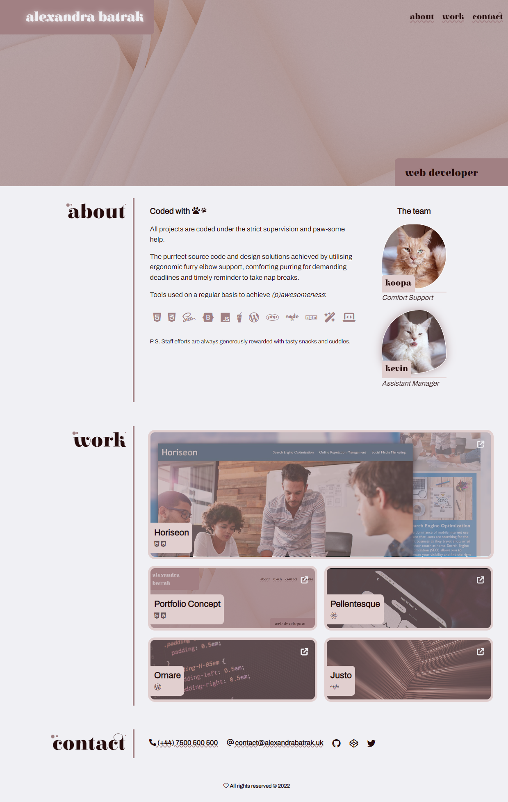

# Portfolio (concept)

## About 

🤍

*An effective portfolio highlights the strongest work as well as the thought processes behind it.*

## Feautres

- [x] HTML layout of a page containing a name, a recent photo or avatar, and links to sections "about", "work", and "contact"
- [x] On-page navigation
- [x] Titled images of applications in "work" section, presented in a flexible layout with the first image larger than the rest
- [x] Working links to deployed applications (with placeholders)
- [x] Fully Responsive layout
- [x] Delicate animations
- [x] Additional animated descriptive content, also accessible for non-touch-based devices
- [x] Accessible integration of FontAwesome

## [View Portfolio Project](https://alexandrabatrak.github.io/portfolio-concept-page/)

The one-page web application has been thoroughly tested to make sure it's **pixel-purrfect**, **accessible** and **mobile/touch devices friendly**.
Best viewed in webkit-based browser (has not been tested in IE, no support provided). 

## Credits

- [Unsplash](https://unsplash.com/) provides images for placeholders and header.
- [WCAG Contrast Checker](https://webaim.org/resources/contrastchecker/)
- [WAVE Web accessibility evaluation tool](https://wave.webaim.org/)
- [BunnyFonts](https://fonts.bunny.net/). 🐇 [Alejandro Inler](mailto:alejandroinler@gmail.com), font 'Elsie' || The Archivo Project [Authors](https://github.com/Omnibus-Type/Archivo)
- [FontAwesome](https://fontawesome.com/)

Obtained information:
- [Detecting touch devices with CSS only](https://ferie.medium.com/detect-a-touch-device-with-only-css-9f8e30fa1134)
- [Floaties animation inspiration](https://medium.com/@simonpsteer/building-not-so-simple-animations-with-pseudo-elements-ff71d48682a7)

## License

Licenced under the [MIT](/LICENSE) license.

*Copyright © 2022 Alexandra Batrak*
